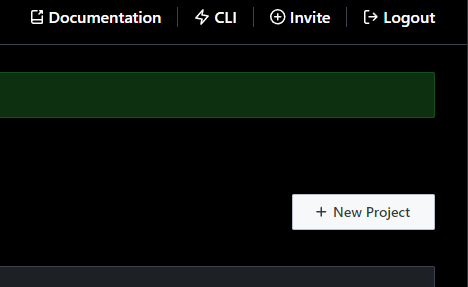
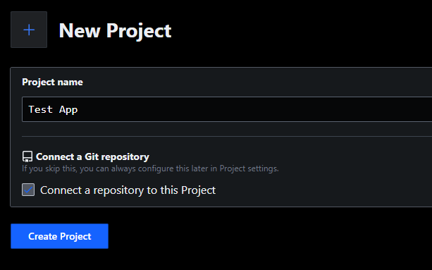
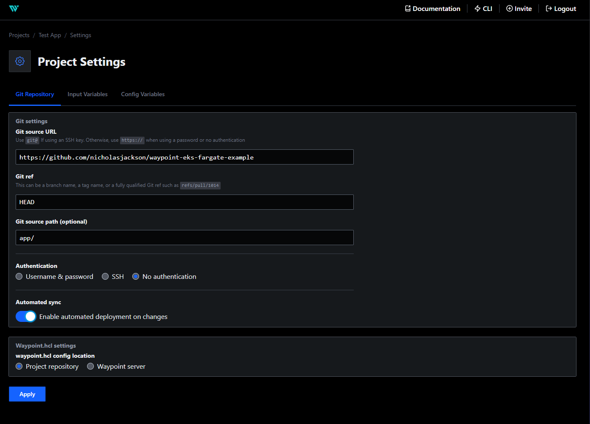
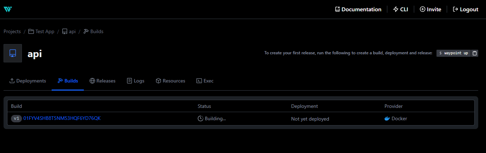
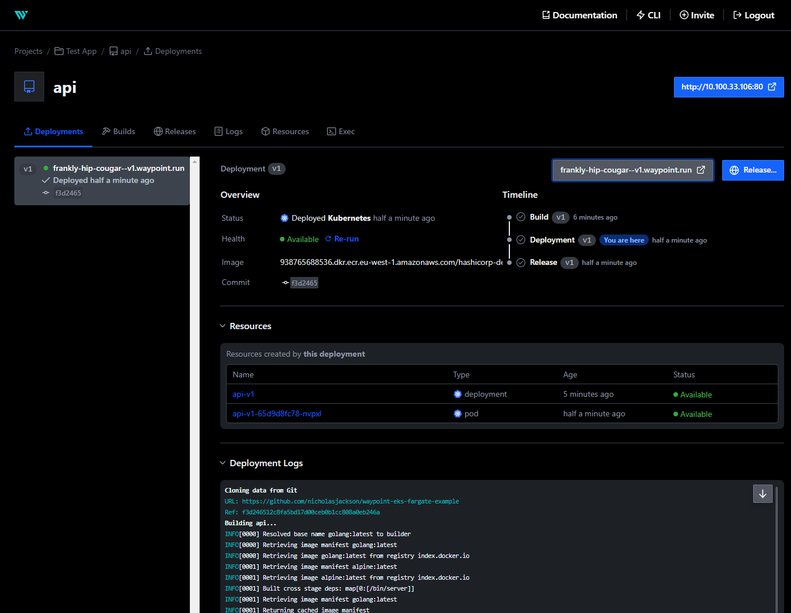

# AWS EKS Fargate With Waypoint


### Creates:

* EKS Cluster
* Managed Node Group for Waypoint server and other core services
* Fargate Profile for Waypoint apps
* Security Groups and Subnets
* Example ECR repository for example app
* AWS ALB Controller for EKS
* Waypoint install on EKS

## Install Terraform 1.13
Download and install the appropriate Terraform binary for your environment from the following location:

https://releases.hashicorp.com/terraform/1.1.7/

You will also need to set your AWS credentials for Terraform

https://registry.terraform.io/providers/hashicorp/aws/latest/docs#authentication

## Install the Waypoint UI
Download and install the appropriate Waypoint binary for your environment from the following location:

https://releases.hashicorp.com/waypoint/0.7.2/

## Install AWS CLI
To connect to an EKS cluster the AWS CLI is required to create the Kubernetes config.

```shell
curl "https://awscli.amazonaws.com/awscli-exe-linux-x86_64.zip" -o "awscliv2.zip"
unzip awscliv2.zip
sudo ./aws/install
rm awscliv2.zip
```

## Creating the resources

Once you have Terraform and the AWS CLI setup, you can run `terraform apply` to create the EKS cluster.

```shell
terraform apply
```

```shell
Terraform used the selected providers to generate the following execution plan. Resource actions are indicated with 
the following symbols:

  + create
 <= read (data resources)

Terraform will perform the following actions:

  # data.aws_eks_cluster.cluster will be read during apply
  # (config refers to values not yet known)
 <= data "aws_eks_cluster" "cluster"  {

# ...


Do you want to perform these actions?
  Terraform will perform the actions described above.
  Only 'yes' will be accepted to approve.

  Enter a value:
```

```
Apply complete! Resources: 77 added, 0 changed, 0 destroyed.

Outputs:

cluster_endpoint = "https://A472718EDEFE67317CB489A8120B3565.yl4.eu-west-1.eks.amazonaws.com"
cluster_name = "test-eks-2Fsmvylz"

# ...
```

Once Terraform completes your EKS cluster and installs Waypoint you can setup the context so that you can 
connect to it from the CLI. 

**Note:** It can take several minutes from the the creation of the ALB that exposes
the Waypoint UI before all the health checks are passing and it is ready to accept traffic.

## Configure Waypoint

To connect to Waypoint you can use the following command to create a waypoint context. The command automatically
retrieves the public address of the Waypoint server from the Kubernetes service, and the auth token from the 
Kubernetes secret that was created when the server was bootstrapped.

```shell
waypoint context create \
  -server-addr=$(kubectl get svc waypoint-ui -o=jsonpath="{.status.loadBalancer.ingress[0].hostname}"):9701 \
  -server-auth-token=$(kubectl get secrets waypoint-server-token -o=jsonpath="{.data.token}" | base64 -d) \
  -server-tls-skip-verify=true \
  -set-default=true \
  -server-require-auth=true \
  eks
```

## Accessing the Waypoint UI

To open the Waypoint UI in your browser you can execute the following command

```shell
waypoint ui -authenticate
```

## Configure the application
Let's deploy a simple Waypoint application.

First, click the `New Project` button in the Waypoint UI.



Give the project a name and click the `Connect a repository to this Project` checkbox.



Fill in the project details:

#### Git source URL ####

```
https://github.com/nicholasjackson/waypoint-eks-fargate-example
```

#### Git source path (optional ####

```
app/
```

Check the `Automated sync` button and ensure that the `waypoint.hcl config location` is set to `Project repository`.



Once you press the `Apply` button Waypoint will start building your application, it may take a few seconds for the build to start.



Waypoint uses an on-demand runner to build the application on your EKS cluster and then pushes it to ECR. After the build completes
the application will be deployed to your cluster as a Fargate pod.



You will now be able to access the application using the Waypoint URL

```shell
curl https://easily-glowing-mongrel--v1.waypoint.run/
Hello World% 
```

## Destroying the demo

Running resources cost money so do not forget to tear down your cluster, you can run the `terraform destroy` command to remove 
all the resources you have created.

The AWS Load Balancing controller does not always destroy the resources it creates when removing the Helm chart, since the 
ALBs are associated with the Terraform created VPC `terraform destroy` will fail if any of the load balancers are not removed.

To manually remove the ALBs, you can use the following command:

```shell
kubectl delete svc --all
```

Then you can destroy the resources with Terraform as normal.

```shell
terraform destroy
```
